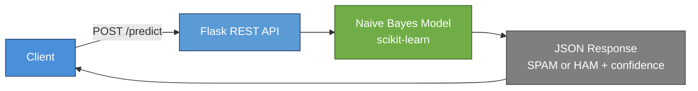
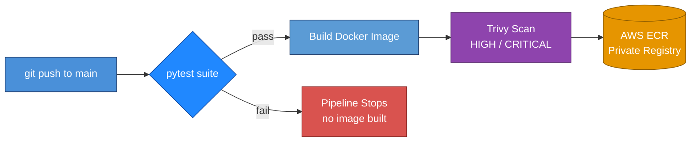

# AI Spam Classifier — Dockerized ML Service with Test-Gated CI/CD

[](https://github.com/sadvi11/docker-flask-ai-app/actions/workflows/ci.yml)


> A Flask REST API serving a spam classifier, containerized with Docker and shipped through a GitHub Actions pipeline that runs tests before it builds, and scans every image before pushing to AWS ECR.


## What it actually produces

Real output from the [latest CI run](https://github.com/sadvi11/docker-flask-ai-app/actions).
Tests gate the build, and the image is scanned before it can ship:

```console
============================== 5 passed in 0.98s ===============================

installing Trivy binary
Running Trivy with options: trivy image spam-classifier-ai:ci
```

**The scan exits non-zero on HIGH or CRITICAL**, so a vulnerable image fails
the build rather than being reported and pushed anyway. A scan that only
reports is a scan people learn to scroll past.


## What This Demonstrates

- Machine learning served over a clean REST API
- Containerization with Docker for portable, reproducible deployment
- Test-gated CI/CD: tests run on every commit, build only proceeds if they pass
- Security scanning of every image before it ships — and the scan **fails the build**
  on a HIGH or CRITICAL finding rather than reporting it and moving on
- **No AWS credentials exist to leak.** Deployment authenticates by OIDC federation,
  so GitHub receives short-lived tokens instead of a stored access key

## Architecture

### Runtime Request Flow



### CI/CD Delivery Pipeline



The key design decision: build depends on test. If a single test fails, the Docker image is never built and never reaches ECR.

## API Endpoints

| Method | Endpoint | Description |
|---|---|---|
| GET | /  | Service info and available endpoints |
| GET | /health | Health check for orchestrators / load balancers |
| POST | /predict | Classify text as SPAM or HAM, with confidence score |

Example:
```bash
curl -X POST http://localhost:5000/predict \
  -H "Content-Type: application/json" \
  -d '{"text": "Congratulations! You won a free prize!"}'
```

## Testing

```bash
pytest -v
```

| Test | Verifies |
|---|---|
| test_home_endpoint | Service info responds correctly |
| test_health_endpoint | Health check returns healthy |
| test_predict_spam | Spammy message classified as SPAM |
| test_predict_ham | Normal message classified as HAM |
| test_predict_missing_text | Invalid input returns 400 error |

Testing the failure case, not just the happy path, is deliberate — reliability means knowing how a system behaves when input is wrong.

## CI/CD Pipeline

On every push to main, GitHub Actions runs a test-gated pipeline:

| Stage | Tool | What happens |
|---|---|---|
| Test | pytest | Runs the full test suite |
| Build | Docker | Builds the image, only if tests pass |
| Scan | Trivy | Scans for HIGH and CRITICAL vulnerabilities |
| Push | AWS ECR | Pushes to a private registry |

## Security Design

**No long-lived AWS credential exists.** The deploy workflow authenticates through
OIDC federation: GitHub presents a signed token, AWS validates it against a trust
policy scoped to this repository, and returns credentials that expire. There is no
access key stored in the repository or in repository settings, so there is nothing to
leak and nothing to rotate. The only configured value is the ARN of the role to
assume, which is not a secret — it is useless without a trust policy that names this
repository.

- **OIDC federation, no stored access key** — short-lived tokens, scoped to this repo
- **The scan gates the push.** Trivy runs against the exact image that is about to
  ship and exits non-zero on HIGH or CRITICAL. A scan that only reports is a scan
  people learn to scroll past
- **Scanned twice, deliberately** — on every commit in CI, and again at deploy time
  against the artifact being pushed, because the base image can acquire a CVE between
  the commit that passed and the day you deploy it
- **Immutable tags** — images are tagged with the commit SHA as well as `latest`, so
  there is always a specific version to roll back to
- Private AWS ECR registry, IAM-controlled
- Minimal container attack surface

## Tech Stack

Python · Flask · scikit-learn (Multinomial Naive Bayes) · Docker · docker-compose · GitHub Actions · pytest · AWS ECR · Trivy

## Quick Start

```bash
git clone https://github.com/sadvi11/docker-flask-ai-app.git
cd docker-flask-ai-app
docker build -t flask-ai-app .
docker run -p 5000:5000 flask-ai-app
pytest -v
```

## Author

Sadhvi Sharma — Cloud & AI Engineer
Ex-Nokia (cloud-native 5G core, 99.9% SLA production) → Cloud & AI Engineering
Calgary, AB, Canada · Permanent Resident · Open to Relocation

[LinkedIn](https://linkedin.com/in/sadhvi-sharma) · [GitHub](https://github.com/sadvi11)
