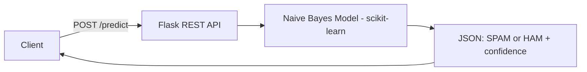
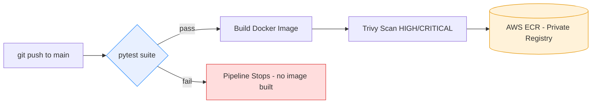

# AI Spam Classifier — Dockerized ML Service with Test-Gated CI/CD

> A Flask REST API serving a spam classifier, containerized with Docker and shipped through a GitHub Actions pipeline that runs tests before it builds, and scans every image before pushing to AWS ECR.

## What This Demonstrates

- Machine learning served over a clean REST API
- Containerization with Docker for portable, reproducible deployment
- Test-gated CI/CD: tests run on every commit, build only proceeds if they pass
- Security scanning of every image before it ships
- Secure secrets handling via GitHub Secrets

## Architecture

### Runtime Request Flow



### CI/CD Delivery Pipeline



The key design decision: build depends on test. If a single test fails, the Docker image is never built and never reaches ECR.

## API Endpoints

| Method | Endpoint | Description |
|---|---|---|
| GET | /  | Service info and available endpoints |
| GET | /health | Health check for orchestrators / load balancers |
| POST | /predict | Classify text as SPAM or HAM, with confidence score |

Example:
```bash
curl -X POST http://localhost:5000/predict \
  -H "Content-Type: application/json" \
  -d '{"text": "Congratulations! You won a free prize!"}'
```

## Testing

```bash
pytest -v
```

| Test | Verifies |
|---|---|
| test_home_endpoint | Service info responds correctly |
| test_health_endpoint | Health check returns healthy |
| test_predict_spam | Spammy message classified as SPAM |
| test_predict_ham | Normal message classified as HAM |
| test_predict_missing_text | Invalid input returns 400 error |

Testing the failure case, not just the happy path, is deliberate — reliability means knowing how a system behaves when input is wrong.

## CI/CD Pipeline

On every push to main, GitHub Actions runs a test-gated pipeline:

| Stage | Tool | What happens |
|---|---|---|
| Test | pytest | Runs the full test suite |
| Build | Docker | Builds the image, only if tests pass |
| Scan | Trivy | Scans for HIGH and CRITICAL vulnerabilities |
| Push | AWS ECR | Pushes to a private registry |

## Security Design

- Credentials in GitHub Secrets, never in code
- Private AWS ECR registry, IAM-controlled
- Trivy vulnerability scanning on every image
- Minimal container attack surface

## Tech Stack

Python · Flask · scikit-learn (Multinomial Naive Bayes) · Docker · docker-compose · GitHub Actions · pytest · AWS ECR · Trivy

## Quick Start

```bash
git clone https://github.com/sadvi11/docker-flask-ai-app.git
cd docker-flask-ai-app
docker build -t flask-ai-app .
docker run -p 5000:5000 flask-ai-app
pytest -v
```

## Author

Sadhvi Sharma — Cloud & AI Engineer
Ex-Nokia (cloud-native 5G core, 99.9% SLA production) → Cloud & AI Engineering
Calgary, AB, Canada · Permanent Resident · Open to Relocation

[LinkedIn](https://linkedin.com/in/sadhvi-sharma) · [GitHub](https://github.com/sadvi11)
